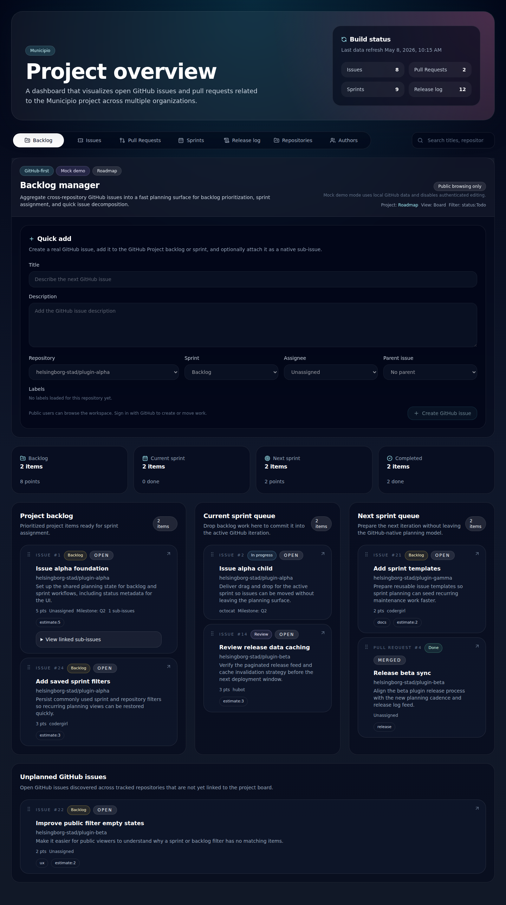
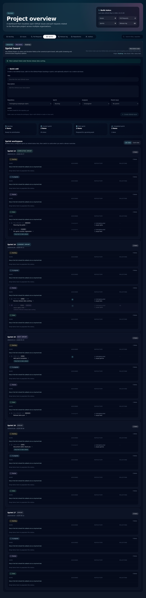

# GitHub-first sprint and backlog management

## Product boundary

This implementation keeps GitHub as the canonical source of truth.

The application is intentionally a projection and planning layer on top of:

- GitHub Projects v2
- GitHub Issues
- GitHub sub-issues
- GitHub labels
- GitHub iterations
- GitHub milestones
- GitHub pull requests

The app does **not** create a parallel project-management database, custom issue IDs, or a synchronization engine.

## Public browsing

Public and unauthenticated users browse generated JSON from `public/data/`.

The build step reads GitHub directly and writes a static planning projection:

- `issues.json`
- `pull-requests.json`
- `sprints.json`
- release JSON pages

That keeps the public UI fast while preserving GitHub as the canonical system.

## Authenticated editing

Authenticated editing is implemented through lightweight Vercel serverless functions in `api/`.

Responsibilities are intentionally minimal:

- start GitHub OAuth with PKCE
- exchange the OAuth code server-side
- store a signed session cookie
- proxy authenticated GraphQL mutations to GitHub

There is no persistent application database.

## Data model

### Aggregated source payloads

`issues.json` and `pull-requests.json` now include GitHub-native metadata needed for planning:

- node ID
- state
- labels
- assignees
- milestone
- sub-issue summaries
- relationship summaries

### Planning payload

`sprints.json` now carries a GitHub Project v2 planning projection with:

- project metadata
- active view metadata
- active filter text
- status field options
- iteration field metadata
- all configured sprint buckets
- backlog bucket
- completed sprint bucket
- current sprint bucket
- next sprint bucket
- project item IDs and GitHub content IDs for mutations
- issue and pull request descriptions for richer planning cards and lists

This makes drag/drop planning possible without creating shadow records.

## Editing flows

### Quick add

Quick add creates a real GitHub issue first.

If the user selects backlog or a sprint target, the app then:

1. adds the issue to the GitHub Project v2 board
2. sends the issue description/body to GitHub
2. sets the GitHub Project status field
3. optionally sets the iteration field
4. optionally creates a native GitHub sub-issue relationship

The sprint workspace now defaults to a nested list view across all configured iterations and can be switched to a denser card view when needed.

### Drag and drop

Drag/drop updates GitHub Project v2 directly through GraphQL mutations:

- `addProjectV2ItemById`
- `updateProjectV2ItemFieldValue`
- `clearProjectV2ItemFieldValue`
- `updateProjectV2ItemPosition`
- `addSubIssue`

Optimistic UI updates are applied client-side first and then reconciled with GitHub.

## Local development

### Public browsing only

Run the static UI and data build:

```bash
cp .env.example .env.local
# fill in GITHUB_TOKEN at minimum
npm install
composer install
npm run build:data
npm run dev
```

### Mock demo mode

For UI demos, design review, or screenshot capture without live GitHub credentials, start the app and add `?mock=1` to the URL:

```bash
npm install
npm run dev
```

Open:

```bash
http://127.0.0.1:5173/?mock=1
```

Mock mode:

- loads local planning, issue, pull request, and release payloads
- includes a larger multi-sprint planning dataset for demos and screenshots
- keeps public browsing active
- disables authenticated editing
- preserves the real GitHub-first production architecture

### Public browsing plus authenticated editing

Run the app through Vercel so `/api/*` routes are available:

```bash
cp .env.example .env.local
npm install
composer install
npm run build:data
npx vercel dev
```

## Required GitHub OAuth configuration

Create a GitHub OAuth App and configure:

- **Homepage URL**: your frontend origin
- **Authorization callback URL**: `https://your-domain.tld/api/auth/callback`

Recommended scopes:

- `read:user`
- `repo`
- `project`

Those scopes support issue creation, project updates, label assignment, and iteration/status planning.

## Environment variables

### Static build variables

- `GITHUB_TOKEN`: required for aggregation
- `ITEM_LOOKBACK_DAYS`: optional lookback window for issues and pull requests
- `GITHUB_TOPICS`: comma-separated repository topics to aggregate
- `GITHUB_PROJECT_OWNER`: GitHub organization or owner that holds the tracked Project v2
- `GITHUB_PROJECT_NUMBER`: Project v2 number
- `GITHUB_RELEASE_REPOSITORY`: owner/name for the tracked release log repository

### Runtime auth variables

- `GITHUB_APP_URL`: frontend URL used after login
- `GITHUB_OAUTH_CLIENT_ID`: GitHub OAuth App client ID
- `GITHUB_OAUTH_CLIENT_SECRET`: GitHub OAuth App client secret
- `GITHUB_SESSION_SECRET`: signing secret for the session and PKCE cookies
- `GITHUB_OAUTH_SCOPES`: optional override for OAuth scopes

## Deployment shape

Recommended deployment split:

- Vercel hosts the frontend bundle and `api/` serverless functions
- the scheduled data refresh continues to build static JSON for public browsing
- authenticated edits always go back to GitHub directly through the Vercel proxy

That keeps the system GitHub-native, simple, and operationally lightweight.

## Demo screenshots

### Mock backlog view



### Mock sprint board view


